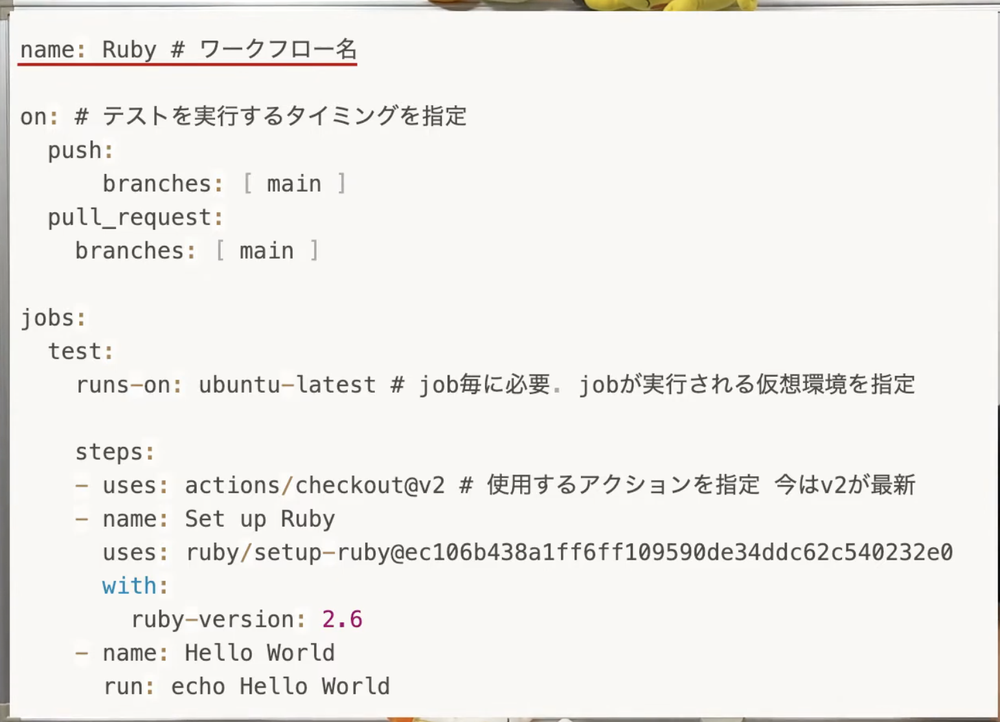

```yml
name: CI Test

on:
  push:
    branches: [main, develop]
  pull_request:
  workflow_call: # 再利用可能なワークフロー、staging.yml から呼び出せるようにする

jobs:
  test:
    runs-on: ubuntu-latest # 実行環境（どのOSか）

    steps:
      - name: Checkout
        uses: actions/checkout@v4 # リポジトリのコードをCI環境にダウンロードする

      # PHPのセットアップ
      - name: Setup PHP
        uses: shivammathur/setup-php@v2 # 指定したバージョンのPHP環境を作るためのAction
        with:
            php-version: '8.4'

      # 依存ライブラリインストール（composer）
      - name: Install dependencies
        run: composer install --prefer-dist --no-progress
        working-directory: src

      # Vite manifest が必要なため Node.js セットアップ＆フロントエンドビルド
      - name: Setup Node.js
        uses: actions/setup-node@v4
        with:
          node-version: '20'

      # .env を作成して APP_KEY を生成
      - name: Prepare environment
        run: |
          cp .env.example .env
          php artisan key:generate --force
        working-directory: src

        # テスト実行
        - name: Run tests
            run: php artisan test
            working-directory: src
```

## 定型文
